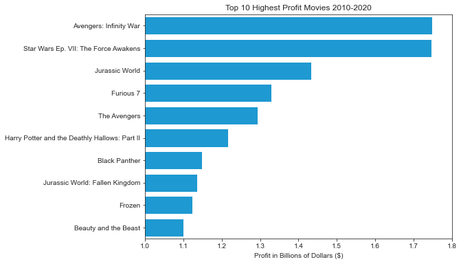
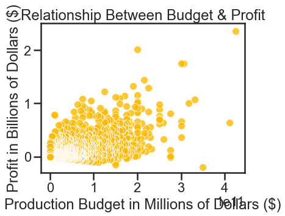
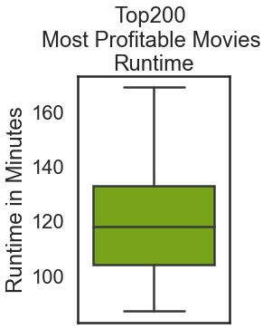
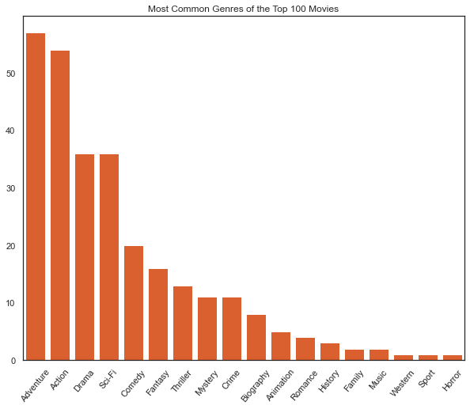

# Microsoft-Movie-Studio-Business-Proposition


**Authors**: Anthony Warren, Edel Prado, Hatice Kastan, Justin Sohn, Marcelo Scatena

## Overview

Microsfot is creating a movie studio and wants business recommendations for it. Information was gathered by cleaning and analyzing databases from Imdb, Rotten Tomatoes, Tmdb Bom and The Numbers. With that analysis it was possible to gather which type of movies were more profitable. The recommendations for Microsoft Movie Studio that we suggest are: 

* Makes movies based on existing popular franchises
* Keep the runtime between 105 and 135 minutes
* Focus on Action/Adventure, Drama, and Family genres
***

## Business Problem

Creating a strategy to develop a new studio demands data. To start a studio Microsoft needs to first come up with a plan of action, regarding which kind of movies to make. With that in mind we looked into what are the movies that are currently more profitable. The results of these findings will provide information on which steps Microsoft should take to be the most successful in their new endeavor.
***

## Data

This project analysed data from Imdb, Rotten Tomatoes, Tmdb, Bom and The Numbers. They provide crucial information regarding profitable movies and correlate them to genre, runtime and budget.
We sampled most of the information in regarding the last ten years of movies.
***

## Methods

The datasets had to be cleaned and filtered. 
* Small values that were not related to top grossing movies were dropped
* NaN values were handled in a case to case basis
* Numbers were turned into integers

The data was modeled to arrive in the following visualisations:
* Most profitable movies
* Popularity by genre
* Budget related to profitability
* Runtime of most profitable movies

These visualisations will give us enoguh information to make accurate predictions of what Microsoft Movie Studio should aim to.
***

## Results

* The results indicate a clear movement towards franchise movies that have in-movie universes. Avengers, Star Wars, Jurassic Park, Fast and Furious and Harry Potter are all amongst the most profitable movies of all time, most having multiple instances in it, and are all franchise movies



* The budget of big box office movies show positive correlation with their profit, and shows how high budget movies have a lower chance of not making profits.



* Range of most profitable movie runtimes is between 105 and 135 minutes



* Action, Adventure and Thriller are the public most well reviewed genres


***

Here is an example of how to embed images from your sub-folder:

## Conclusions

Given all the information we gathered and visualized, the recommendations we have are:
***
* Makes movies based on existing popular franchises

The data suggest that big movie franchises are taking over the box office. The conclusion is to get into that area by acquiring the IP of a famous and well rated book series that would adapt well to the movie media.

***
* Keep the runtime between 105 and 135 minutes

The top200 most profitable movies in the last twnty years have an interquartile range between 105 and 135 minutes.

***
* Focus on Action/Adventure, Drama, and Family genres

These genres are the most popular acording to data votes.
***

## For More Information

Please review our full analysis in [our Jupyter Notebook](./dsc-phase1-project.ipynb) or our [presentation](./Presentation.pdf).

For any additional questions, please contact<br />
**Anthony Warren: anthonywarren6@gmail.com**<br />
**Edel Prado: edel.prado.jr@gmail.com**<br />
**Hatice Kastan: kastanhatice@gmail.com**<br />
**Justin Sohn: jusohn2015@gmail.com**<br />
**Marcelo Scatena: marcelo.oddo@gmail.com**<br />

## Repository Structure


```
├── README.md                           
├── dsc-phase1-project-template.ipynb   
├── DS_Project_Presentation.pdf         
├── data                                
└── images                              
```
